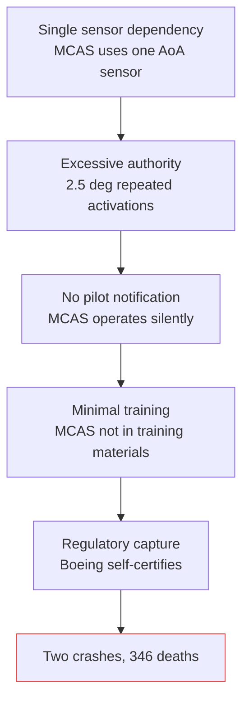

import TawkWidget from '../../../../components/TawkWidget.astro';
import UniversalContentContributors from '../../../../components/UniversalContentContributors.astro';
import InArticleAd from '../../../../components/InArticleAd.astro';
import Copyright from '../../../../components/Copyright.astro';
import BionicText from '../../../../components/BionicText.astro';
import TailwindWrapper from '../../../../components/TailwindWrapper.jsx';
import { Tabs, TabItem } from '@astrojs/starlight/components';
import { Card, CardGrid, Badge, Steps, LinkButton, FileTree } from '@astrojs/starlight/components';

<UniversalContentContributors 
  contributors={frontmatter.contributors}
/>


import PhilosophyOfScienceEngineeringComments from '../../../../components/philosophy-of-science-engineering/PhilosophyOfScienceEngineeringComments.astro';

Engineers do not just solve technical problems. They make decisions that determine whether bridges stand or fall, whether medical devices heal or harm, whether software protects or endangers. That power comes with moral obligations that no amount of technical skill can replace. This lesson examines real engineering disasters, the ethical failures behind them, and the professional frameworks designed to keep the public safe. #EngineeringEthics #Responsibility #SafetyFirst

## The Weight of Engineering Decisions

Every time you select a material, write a control algorithm, or sign off on a design, you are making a decision that may affect people who will never know your name. The bridge you design will carry thousands of commuters. The firmware you write may control a device that a patient depends on. The sensor system you deploy may generate data that shapes decisions about people's lives.

<Card title="Core Principle" icon="warning">
Engineering ethics is not abstract philosophy. It is the practical discipline of ensuring that technical decisions protect human welfare. When engineers get it wrong, people die.
</Card>

This is not hypothetical. The following case studies are real, documented, and deeply instructive.

## Case Study: The Therac-25

<InArticleAd />


Between 1985 and 1987, the Therac-25 radiation therapy machine delivered massive radiation overdoses to at least six patients. Three of them died. The cause was a combination of software bugs, hardware design choices, and organizational failures.

### What Happened

The Therac-25 was a linear accelerator used to treat cancer patients with targeted radiation. It had two modes: a low-power electron beam for direct treatment and a high-power X-ray mode that used a metal target to convert the electron beam into X-rays.

In previous models (Therac-6 and Therac-20), hardware interlocks physically prevented the high-power beam from firing without the metal target in place. The Therac-25 removed these hardware interlocks and relied entirely on software to ensure the correct configuration.

The software had a race condition. If an operator typed commands fast enough (changing from X-ray mode to electron mode), the software could set the beam energy to the high-power level while the metal target was retracted. The result was a full-power electron beam hitting the patient directly, delivering doses hundreds of times higher than intended.

### What Went Wrong Technically

| Technical Failure | Description |
|------------------|-------------|
| Race condition | Software did not properly synchronize mode selection with beam energy setting |
| No hardware interlocks | Safety-critical function delegated entirely to software |
| Inadequate error messages | Machine displayed "MALFUNCTION" with a number that operators could not interpret |
| No dose monitoring | No independent hardware check on actual delivered dose |
| Code reuse without review | Software was carried over from earlier models without full analysis of the changed hardware context |

### What Went Wrong Ethically

The technical bugs were serious, but the ethical failures were worse:

**The manufacturer dismissed reports.** When hospitals reported overdoses, AECL (the manufacturer) initially insisted the machine could not deliver an overdose. They trusted their software more than the evidence from patients.

**Operators were blamed.** Early incident reports attributed the overdoses to operator error, not machine malfunction. The operators knew something was wrong but lacked the information to prove it.

**No independent safety review.** The software was never subjected to an independent safety analysis. The same team that wrote it reviewed it.

**No regulatory requirement for software safety.** At the time, the FDA did not have a clear framework for evaluating software in medical devices. The Therac-25 incidents directly led to changes in FDA regulation.

<Card title="Lesson" icon="information">
Software can kill. When software controls safety-critical functions, it must be treated with the same rigor as hardware safety systems. Removing hardware interlocks and relying solely on software is a design decision with ethical weight.
</Card>

## Case Study: Boeing 737 MAX

<InArticleAd />


In October 2018 and March 2019, two Boeing 737 MAX aircraft crashed, killing 346 people. The crashes were caused by a software system called MCAS (Maneuvering Characteristics Augmentation System) that repeatedly pushed the nose of the aircraft down based on a single faulty sensor reading.

### The Technical Problem

The 737 MAX had larger, more fuel-efficient engines than the previous 737 NG. These engines were mounted further forward and higher on the wing, changing the aircraft's aerodynamic behavior. At high angles of attack, the new engine position created a nose-up pitching moment that could surprise pilots accustomed to the 737 NG.

Boeing's solution was MCAS: a software system that automatically pushed the nose down when a single angle-of-attack (AoA) sensor indicated a high angle. The system was designed to make the 737 MAX feel like the 737 NG to pilots, avoiding the need for expensive retraining in a full simulator.

### The Chain of Failures



<Steps>
1. **Single sensor dependency.** MCAS relied on a single AoA sensor. The 737 MAX had two AoA sensors, but MCAS only used the one on the captain's side. If that sensor failed or gave erroneous data, MCAS would activate based on false information.
2. **Excessive authority.** In its original design, MCAS could move the horizontal stabilizer by 0.6 degrees per activation. After flight testing revealed it was not aggressive enough, Boeing increased it to 2.5 degrees and allowed repeated activations, giving the system enough authority to overpower the pilots.
3. **No pilot notification.** MCAS operated silently. Pilots did not know when it was active. The disagree light that would have alerted pilots to mismatched AoA sensors was an optional feature that most airlines did not purchase.
4. **Minimal training.** Boeing marketed the 737 MAX as requiring only a short tablet-based training course instead of simulator training. MCAS was not mentioned in the initial training materials.
5. **Regulatory capture.** Boeing had been granted authority to self-certify many aspects of the aircraft. FAA oversight was reduced through a program called Organization Designation Authorization (ODA). Engineers within Boeing who raised safety concerns were overruled by management focused on schedule and cost.
</Steps>

### Comparison with Airbus Philosophy

The contrast with Airbus's design philosophy is instructive. Airbus fly-by-wire systems use multiple redundant computers with dissimilar software (different teams write code for the same function independently). The systems cross-check each other continuously. When sensors disagree, the system alerts the pilot rather than silently acting on one sensor's data.

Airbus A320 family aircraft use three AoA sensors. The flight control computers compare all three and use a voting scheme to reject faulty readings. The Boeing 737 MAX used two AoA sensors but fed only one to MCAS. The cost difference between using one sensor input and three was trivial compared to the aircraft's total cost, but the safety difference was enormous.

### The Ethical Dimensions

**Engineers raised concerns and were ignored.** Internal communications released during investigations showed that Boeing engineers and test pilots had serious concerns about MCAS. One test pilot described the system as "egregious" in a 2016 message. These concerns did not reach decision-makers, or when they did, they were overridden by schedule pressure.

**Financial incentives distorted safety decisions.** The 737 MAX existed because Boeing needed to compete with the Airbus A320neo quickly. Designing a new aircraft would have taken years and cost billions. Modifying the existing 737 was faster and cheaper but introduced the aerodynamic problems that MCAS was designed to mask.

**Transparency was sacrificed.** Boeing did not fully disclose MCAS to airlines, pilots, or regulators. The system was buried in documentation. When the first crash occurred (Lion Air 610), Boeing issued a bulletin but did not ground the fleet. The second crash (Ethiopian Airlines 302) happened five months later.

<Card title="Lesson" icon="warning">
When organizational pressure to meet schedules and reduce costs conflicts with safety, safety must win. Engineers have a professional obligation to escalate safety concerns through every available channel. "I raised it but was overruled" is not sufficient if lives are at stake.
</Card>

## Case Study: Volkswagen Emissions Scandal

<InArticleAd />


In September 2015, the U.S. Environmental Protection Agency revealed that Volkswagen had installed software in 11 million diesel vehicles worldwide that detected when the vehicle was undergoing emissions testing and reduced nitrogen oxide emissions during the test. Under normal driving conditions, the vehicles emitted up to 40 times the legal limit of NOx.

### How It Worked

The "defeat device" was software running on the engine control unit (ECU). It monitored steering wheel position, vehicle speed, engine operation duration, and barometric pressure. When the pattern matched the profile of a standardized emissions test (the vehicle was stationary on a dynamometer, wheels turning but steering wheel fixed), the software activated a low-emissions mode. In all other driving conditions, the software prioritized performance and fuel economy over emissions compliance.

### The Engineering Ethics

This was not a bug. It was not an oversight. Engineers deliberately wrote software to deceive regulators and the public. The code was designed, reviewed, tested, and deployed with full knowledge of its purpose.

**"I was told to" is not an excuse.** Several VW engineers claimed they were following orders from management. Professional engineering ethics codes are explicit: the engineer's primary obligation is to the public, not to their employer. When an employer asks you to do something that endangers public health, you are obligated to refuse.

**The harm was real and quantifiable.** Researchers at MIT estimated that the excess emissions from VW diesel vehicles in the United States alone contributed to approximately 1,200 premature deaths in Europe and 59 in the United States. These are not abstract numbers. They represent people who died from respiratory and cardiovascular disease caused by air pollution that should not have existed.

**The cover-up was sustained.** VW continued to deny the existence of defeat device software for over a year after researchers at West Virginia University detected the discrepancy between test results and real-world emissions. Internal communications show that engineers and managers discussed how to handle the situation without admitting the truth.

| Aspect | Detail |
|--------|--------|
| Vehicles affected | ~11 million worldwide |
| Duration of deception | 2009 to 2015 (at least 6 years) |
| Financial penalties | Over 30 billion USD in fines and settlements |
| Criminal convictions | Several engineers and executives sentenced to prison |
| Health impact | Estimated 1,200+ premature deaths from excess NOx |

<Card title="Lesson" icon="warning">
There is no version of "the company told me to" that justifies writing software designed to deceive regulators and endanger public health. Professional ethics exist precisely for situations where your employer's interests conflict with the public interest.
</Card>

## Professional Codes of Ethics

<InArticleAd />


Engineering professional societies have developed codes of ethics that provide explicit guidance. While the specific wording varies, the core principles are consistent.

### Common Principles

<Tabs>
<TabItem label="IEEE Code of Ethics">
The IEEE Code of Ethics requires members to:

- Hold paramount the safety, health, and welfare of the public
- Avoid real or perceived conflicts of interest
- Be honest and realistic in stating claims based on available data
- Reject bribery in all its forms
- Improve understanding of technology, its appropriate application, and potential consequences
- Maintain and improve technical competence
- Seek, accept, and offer honest criticism of technical work
- Treat all persons fairly and with respect
</TabItem>
<TabItem label="NSPE Code of Ethics">
The National Society of Professional Engineers states:

- Engineers shall hold paramount the safety, health, and welfare of the public
- Engineers shall perform services only in areas of their competence
- Engineers shall issue public statements only in an objective and truthful manner
- Engineers shall act for each employer or client as faithful agents or trustees
- Engineers shall avoid deceptive acts
- Engineers shall conduct themselves honorably, responsibly, ethically, and lawfully
</TabItem>
<TabItem label="The Common Thread">
Every major engineering ethics code puts the same principle first: **public safety comes before employer loyalty, personal gain, or professional convenience.**

This is not a suggestion. In jurisdictions where engineering is a licensed profession, violating this principle can result in loss of licensure, legal liability, and criminal prosecution.
</TabItem>
</Tabs>

### When Codes Conflict with Reality

Ethics codes are clear on paper. In practice, following them can be difficult:

- Your manager asks you to approve a design you believe is marginal. Do you refuse and risk your job?
- A deadline is approaching and the test results are ambiguous. Do you ask for more testing and miss the deadline?
- You discover a safety issue in a product that is already shipping. Do you report it, knowing it will cost the company millions?

The codes are unambiguous: safety comes first. But engineers who follow this principle often face professional consequences. This is why whistleblower protections and strong professional communities matter.

## Whistleblowing: When and How

<InArticleAd />


Whistleblowing is the act of reporting safety concerns, illegal activity, or ethical violations to authorities, regulators, or the public when internal channels have failed.

### When Is Whistleblowing Justified?

Most ethics frameworks agree that whistleblowing is justified when:

<Steps>
1. There is a serious and specific threat to public safety or welfare
2. The engineer has identified the threat through professional competence (not rumor or speculation)
3. Internal reporting channels have been tried and have failed to resolve the issue
4. The engineer has documented the concern and the organization's response
5. The potential harm of not reporting outweighs the potential harm of reporting
</Steps>

### The Personal Cost

Whistleblowers face real consequences. Roger Boisjoly, a Morton Thiokol engineer, warned against launching the Space Shuttle Challenger in cold weather because the O-ring seals had not been tested at low temperatures. Management overruled him. The shuttle broke apart 73 seconds after launch, killing all seven crew members.

After the disaster, Boisjoly testified before a presidential commission. He was praised publicly but effectively blacklisted within the aerospace industry. He suffered depression and PTSD. He spent the rest of his career advocating for engineering ethics education.

The 737 MAX case included similar dynamics. Engineers who raised MCAS concerns were sidelined or ignored. The organizational culture at Boeing had shifted from engineering-led to finance-led, and voices that contradicted the business case were unwelcome.

### Protecting Whistleblowers

Many countries have legal protections for whistleblowers, though enforcement varies:

| Jurisdiction | Key Legislation |
|-------------|----------------|
| United States | Whistleblower Protection Act, Sarbanes-Oxley (for publicly traded companies) |
| European Union | EU Whistleblower Directive (2019) |
| United Kingdom | Public Interest Disclosure Act |
| Kenya | Witness Protection Act |

Legal protection helps, but it does not eliminate the personal cost. Building a professional network, documenting everything, and seeking legal advice early are practical steps.

## Design for Safety

<InArticleAd />


Ethics is not just about reacting to problems. It is about designing systems that minimize the chance of harm in the first place.

### Fail-Safe, Fail-Secure, Fail-Operational

<CardGrid>
  <Card title="Fail-Safe" icon="approve">
    On failure, the system enters a state that minimizes harm. A railroad crossing gate drops if power fails. A chemical valve closes if control signals are lost. The priority is preventing damage.
  </Card>
  <Card title="Fail-Secure" icon="approve">
    On failure, the system maintains security. A secure door locks if power fails. An encrypted channel drops the connection rather than transmitting unencrypted data. The priority is preventing unauthorized access.
  </Card>
  <Card title="Fail-Operational" icon="approve">
    On failure, the system continues operating at reduced capability. A dual-engine aircraft flies on one engine. A RAID array serves data after a disk failure. The priority is maintaining function.
  </Card>
</CardGrid>

The choice between these modes is itself an ethical decision. A fire exit must fail-open (anyone can exit), not fail-secure (door locks). A nuclear reactor must fail-safe (control rods insert automatically), not fail-operational (keep running despite anomalies).

### Safety Margins Are Not Optional

When you design a structure to withstand 100 kN but the calculation shows it only needs to handle 50 kN, the extra capacity is not waste. It absorbs:

- Uncertainty in the load estimate
- Uncertainty in the material properties
- Degradation over time (corrosion, fatigue, wear)
- Loads that were not anticipated in the design
- Manufacturing variations

Cutting safety margins to save cost is a decision with ethical implications. If a failure will endanger human life, the margin must be there regardless of budget pressure.

### The Swiss Cheese Model

James Reason's Swiss cheese model of accident causation describes how catastrophic failures occur when multiple layers of defense all have holes, and those holes happen to align. Each layer (design review, testing, quality control, operational procedures, safety monitoring) has imperfections. Most of the time, a hole in one layer is covered by the next layer. Accidents happen when the holes line up.

```text
  The Swiss Cheese Model (James Reason)

  Hazard                             Accident
  =====>  |   |    |   |    |   |    =====>
          | o |    |   |    | o |
  =====>  |   |    | o |    |   |    =====>
          |   |    |   |    |   |
  =====>  | o-|----|-o-|----|-o-|->  FAILURE
          |   |    |   |    |   |
  =====>  |   |    |   |    | o |    =====>
          |   |    |   |    |   |
         Layer 1  Layer 2  Layer 3
         Design   Testing  Operations
         Review   & QC     & Monitoring

  Each layer has holes (imperfections).
  Accidents happen when holes align.
```

Every case study in this lesson fits the Swiss cheese model:

| Case | Layer 1 Failure | Layer 2 Failure | Layer 3 Failure |
|------|----------------|-----------------|-----------------|
| Therac-25 | Software race condition | No hardware interlocks | Manufacturer dismissed incident reports |
| 737 MAX | Single-sensor MCAS design | Inadequate pilot training | FAA delegated oversight to Boeing |
| VW Emissions | Engineers wrote defeat device | Internal compliance failed to catch it | Regulators relied on lab tests only |

The model shows that safety is not about preventing individual errors. It is about ensuring that no single error can propagate through all layers of defense to cause harm. This is a design problem, an organizational problem, and an ethical problem all at once.

## The Trolley Problem Is Irrelevant

<InArticleAd />


Philosophy courses often discuss the trolley problem: should you divert a runaway trolley to kill one person instead of five? This thought experiment is fascinating for moral philosophers but largely irrelevant for practicing engineers.

Real engineering ethics is not about choosing who dies. It is about:

- **Process:** Following rigorous design, testing, and review procedures
- **Oversight:** Ensuring independent checks catch errors before they reach the field
- **Honesty:** Reporting results accurately, including inconvenient results
- **Transparency:** Documenting decisions and their rationale so they can be reviewed
- **Humility:** Acknowledging what you do not know and designing accordingly

If your engineering practice includes these elements, the trolley problem never arises. Catastrophic failures happen when one or more of these elements is missing.

## IoT and AI Ethics: New Questions

<InArticleAd />


Modern engineering increasingly involves systems that operate autonomously, collect personal data, and make decisions without human oversight. These systems raise ethical questions that traditional engineering ethics did not anticipate.

### Who Is Responsible?

When an autonomous vehicle strikes a pedestrian, who is responsible? The software engineer who wrote the perception algorithm? The project manager who approved the release? The company that marketed the vehicle? The regulatory body that approved it for road use?

Traditional product liability focuses on the manufacturer. But when a system's behavior emerges from machine learning trained on data collected from millions of users, the chain of responsibility is less clear.

### Data Ethics

IoT sensors collect vast amounts of data about people, places, and activities. A temperature sensor in an office building seems innocuous. But combined with occupancy sensors, access logs, and network activity, the same system becomes a surveillance infrastructure that tracks when each employee arrives, where they spend their time, and who they meet with.

Engineers who design these systems have an obligation to consider not just the intended use but the potential for misuse.

### Algorithmic Bias

Machine learning systems trained on historical data can perpetuate and amplify existing biases. A hiring algorithm trained on past hiring decisions will learn whatever biases existed in those decisions. A predictive policing algorithm trained on arrest data will reflect the biases in policing patterns.

Engineers building these systems cannot claim neutrality. The choice of training data, the definition of the objective function, and the selection of features all embed values and assumptions that affect people's lives.

### The Responsibility Gap

A traditional engineering failure has a traceable chain of causation: the bolt was underspecified, the weld was flawed, the calculation was wrong. Someone made a specific decision that can be identified and evaluated.

With autonomous systems, the chain of causation passes through layers of abstraction:

<Steps>
1. **Data collection:** Who decided what data to include and exclude from the training set?
2. **Model architecture:** Who chose the algorithm and its parameters?
3. **Training process:** Who evaluated whether the trained model was "good enough"?
4. **Deployment decision:** Who approved the system for use in the real world?
5. **Runtime behavior:** The system makes decisions that no human explicitly programmed, based on patterns learned from data.
</Steps>

At step 5, the system may produce outcomes that nobody intended, predicted, or even understands. This is the responsibility gap: there may be no single person whose decision caused the harm, yet the harm is real.

Closing this responsibility gap requires new approaches: mandatory logging of decision processes, human-in-the-loop requirements for high-stakes decisions, regular auditing of system outputs for bias and errors, and clear organizational accountability structures that assign responsibility even when causation is diffuse.

### Privacy by Design

The most effective approach to data ethics is not to add privacy protections after the system is built but to embed them from the start:

| Principle | Implementation |
|-----------|---------------|
| Data minimization | Collect only what is strictly necessary for the function |
| Purpose limitation | Use data only for the stated purpose |
| Storage limitation | Delete data when it is no longer needed |
| Anonymization | Remove identifying information whenever possible |
| Access control | Limit who can see what data, with audit logs |
| Transparency | Tell users what data is collected and why |

These are not just good engineering practices. In many jurisdictions (EU's GDPR, Kenya's Data Protection Act, California's CCPA), they are legal requirements.

## An Ethics Checklist for Design Review

<InArticleAd />


Practical ethics requires practical tools. The following checklist can be used during any design review:

<Steps>
1. **Who is affected by this design?** List all stakeholders, including people who will use the product, people who will be near it, people whose data it will collect, and people who will maintain it.
2. **What happens if it fails?** Enumerate failure modes and their consequences. Which failures endanger human safety?
3. **What are the safety margins?** Are they adequate for the uncertainties involved? Has anyone pressured you to reduce them?
4. **Is there independent oversight?** Has someone outside the design team reviewed the safety-critical aspects?
5. **Are test results reported honestly?** Including the results that do not support the design?
6. **What data does this system collect?** Who has access? Could it be used for purposes beyond the original intent?
7. **Who cannot speak for themselves?** Children, elderly users, people with disabilities, future generations, ecosystems. Have their needs been considered?
8. **Would you be comfortable if this decision were public?** If the details of your design tradeoffs appeared in a newspaper, would you be able to defend them?
</Steps>

No checklist replaces good judgment. But a checklist ensures that important questions are at least asked, even under time pressure.

### Building an Ethics Culture

A checklist is a starting point, but lasting ethical practice requires organizational culture. Individual engineers can influence culture even without authority:

- **Normalize safety discussions.** When someone raises a safety concern in a meeting, thank them publicly. Make it clear that raising concerns is valued, not penalized.
- **Ask the uncomfortable questions.** If nobody is asking "what could go wrong?" in a design review, you start. The first time may feel awkward. The second time, others will join.
- **Document ethical decisions.** When a tradeoff between cost and safety is made, record it. Not as an accusation, but as a decision record. "We chose X over Y because Z" is documentation that protects everyone.
- **Mentor junior engineers.** Technical mentoring is common. Ethical mentoring is rare but equally important. Help junior engineers understand that "the client wants it this way" is not always sufficient justification.

Organizations where ethical concerns are routinely dismissed eventually produce a Therac-25, a 737 MAX, or a VW emissions scandal. Organizations where ethical concerns are routinely heard and addressed avoid these catastrophes, not because their engineers are smarter, but because their culture supports doing the right thing.

## Exercises

<InArticleAd />


1. Read the full Nancy Leveson report on the Therac-25 incidents (available online as "Medical Devices: The Therac-25"). Identify three specific points where a different technical decision would have prevented patient harm. For each, explain the organizational or economic pressure that led to the actual decision.

2. Research the Challenger disaster and Roger Boisjoly's role. Write a one-page analysis of the decision-making process on the night before launch. Who made the final decision? What information was available? What was the organizational pressure? Would you have done what Boisjoly did?

3. Choose an IoT product you own or use (smart speaker, fitness tracker, connected thermostat). List every type of data it collects. For each data type, identify at least one use beyond the product's stated purpose that could affect users negatively.

4. Using the ethics checklist from this lesson, conduct a review of a project you are working on or have recently completed. Document your answers. Were there questions you had not considered before?

## Summary

<InArticleAd />


Engineering ethics is not a theoretical exercise. It is the practical discipline of ensuring that the enormous power engineers hold over public safety, health, and welfare is exercised responsibly. The Therac-25 showed what happens when software safety is not taken seriously. The 737 MAX showed what happens when organizational pressure overrides engineering judgment. The Volkswagen scandal showed what happens when engineers deliberately betray the public trust. Professional codes of ethics exist to provide clear guidance: public safety comes first, always. Whistleblowing, though personally costly, is sometimes the only ethical option. And proactive design for safety, through fail-safe mechanisms, safety margins, and independent oversight, is the best way to ensure that ethical failures never reach the point where someone must choose between their career and the public good.

<PhilosophyOfScienceEngineeringComments />


<InArticleAd />
<TawkWidget />
<Copyright />