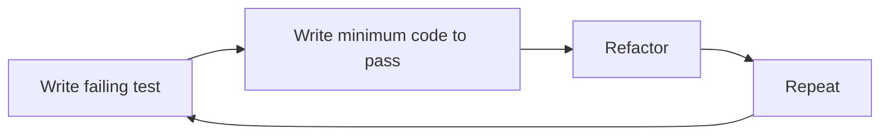

import TawkWidget from '../../../../components/TawkWidget.astro';
import UniversalContentContributors from '../../../../components/UniversalContentContributors.astro';
import InArticleAd from '../../../../components/InArticleAd.astro';
import Copyright from '../../../../components/Copyright.astro';
import BionicText from '../../../../components/BionicText.astro';
import TailwindWrapper from '../../../../components/TailwindWrapper.jsx';
import { Tabs, TabItem } from '@astrojs/starlight/components';
import { Card, CardGrid, Badge, Steps, LinkButton, FileTree } from '@astrojs/starlight/components';

<UniversalContentContributors 
  contributors={frontmatter.contributors}
/>


import PhilosophyOfScienceEngineeringComments from '../../../../components/philosophy-of-science-engineering/PhilosophyOfScienceEngineeringComments.astro';

"My firmware passed all tests." This statement should make you nervous. It tells you nothing about whether the firmware works. It only tells you that the specific tests you wrote did not catch a failure. The question that matters is: how hard did you try to make it fail? This is the essence of Popper's contribution to science, and it is the single most important idea in this course for practicing engineers. #Falsifiability #Testing #Engineering

## The Asymmetry of Evidence

Popper's central insight is that confirmation and refutation are not symmetric. You can never prove a universal claim true, but you can prove it false with a single counterexample.

Consider the claim: "All swans are white." You could observe a million white swans, and the claim would be consistent with all your evidence. But one black swan destroys it entirely. The million confirmations were informative but not conclusive. The single refutation is decisive.

### In Engineering Terms

| Claim | 1000 Confirmations | 1 Refutation |
|-------|-------------------|--------------|
| "Our firmware never crashes" | 1000 hours without a crash | One crash disproves the claim |
| "The bridge supports 10 tons" | 1000 trucks cross safely | One collapse disproves the claim |
| "The encryption is secure" | 1000 failed attack attempts | One successful attack disproves the claim |
| "The sensor reads within 1% accuracy" | 1000 accurate readings | One reading outside 1% disproves the claim |

This asymmetry has a profound implication: **the most informative test is the one most likely to produce a failure.** If you only test cases you expect to work, you are optimizing for confirmation rather than information.

```text
  The Asymmetry of Evidence

  "All swans are white"

  White swan #1     ........  adds a little
  White swan #2     .......   confidence
  White swan #100   ......    but never proves
  White swan #1000  .....     the claim
       :               :
  =============================
  ONE black swan    XXXXX  disproves it
                           entirely
```

## Confirmation Bias in Testing

<InArticleAd />


Confirmation bias is the human tendency to seek, interpret, and remember evidence that confirms your existing beliefs. It is universal, powerful, and deeply destructive in engineering.

### How Confirmation Bias Infects Testing

<Steps>
1. **Test selection bias.** You naturally write tests for the scenarios you thought about during design. These are the cases you expect to work. The cases you did not think about (the ones most likely to reveal bugs) remain untested.

2. **Interpretation bias.** When a test result is ambiguous, you tend to interpret it as passing. "The output was 3.38V instead of 3.30V, but that is probably within tolerance." Is it? Did you check the specification? Or did you want it to pass?

3. **Memory bias.** You remember the 47 tests that passed and forget the 3 flaky tests that you "could not reproduce." Those unreproducible failures often turn out to be real problems with intermittent triggers.

4. **Sunk cost reinforcement.** The more time you have invested in a design, the less willing you become to find problems with it. After three months of development, you are psychologically invested in the design working. This makes you a worse tester of your own work.
</Steps>

### The Happy Path Problem

<Card title="Happy Path Testing" icon="warning">
Testing only the expected use cases and ignoring edge cases, error conditions, and adversarial inputs. This is the most common manifestation of confirmation bias in engineering testing.
</Card>

```
Happy Path (what you test):
  Valid input -> Expected output -> PASS

What you should also test:
  No input -> Graceful handling?
  Maximum input -> Buffer overflow?
  Negative input -> Undefined behavior?
  Rapid repeated input -> Race condition?
  Input during initialization -> Crash?
  Input with bit errors -> Corruption?
  Power loss during processing -> Data loss?
  Two inputs simultaneously -> Deadlock?
```

If your test plan only covers the first line, you have not tested your system. You have confirmed your assumptions.

## Negative Testing: The Popperian Approach

<InArticleAd />


Negative testing is the deliberate attempt to make your system fail. It is Popper's falsification principle applied directly to engineering. Instead of asking "does it work?", you ask "how does it break?"

### Categories of Negative Tests

<Tabs>
<TabItem label="Boundary Conditions">
Test at the exact edges of specified ranges:

- Input voltage at minimum spec, maximum spec, and 1% beyond each
- Temperature at the extremes of the operating range
- Data buffers at exactly their maximum capacity
- Timer values at zero, one, maximum, and rollover
- Array indices at 0, length-1, and length (out of bounds)

If your specification says "operates from 3.0V to 3.6V," test at 2.9V and 3.7V. What happens outside the specified range is often more informative than what happens inside it.
</TabItem>

<TabItem label="Invalid Inputs">
Deliberately provide inputs that violate assumptions:

- Null pointers where the code expects valid data
- Strings where the code expects numbers
- Negative values where the code expects positive
- UTF-8 multi-byte characters in fixed-width fields
- Malformed packets on a communication bus
- Commands sent in the wrong sequence

Every input validation you forgot is a bug waiting for a user to discover.
</TabItem>

<TabItem label="Stress and Overload">
Push the system beyond its design capacity:

- Maximum number of simultaneous connections
- Continuous operation at 100% CPU for 72 hours
- Memory allocation until heap exhaustion
- Rapid power cycling (on-off-on every 100 ms)
- Communication bus at maximum throughput with no idle gaps

Stress testing reveals assumptions you did not know you made.
</TabItem>

<TabItem label="Environmental">
Subject the system to real-world environmental conditions:

- Temperature cycling (hot to cold to hot rapidly)
- Electromagnetic interference (EMI) from nearby motors, radios, switching supplies
- Vibration and mechanical shock
- Humidity extremes
- Power supply noise, dropouts, and surges

The lab is not the field. Environmental testing bridges that gap.
</TabItem>
</Tabs>

### Fuzz Testing: Automated Falsification

Fuzz testing (fuzzing) is the automated generation of random, malformed, or unexpected inputs to find crashes, hangs, and security vulnerabilities. It is Popper's falsification principle implemented as software.

```
Basic Fuzzing Concept:

  for iteration in 1..1000000:
    input = generate_random_data()
    result = system_under_test(input)
    if result == crash or hang or unexpected:
      log(iteration, input, result)
      // Found a failure! This is GOOD NEWS.
      // You now know something you didn't before.
```

Fuzzing has found critical bugs in virtually every major software project, from web browsers to operating systems to embedded firmware. It works because it tests inputs that no human would think to try.

## Case Study: The Challenger Disaster

<InArticleAd />


On January 28, 1986, the Space Shuttle Challenger broke apart 73 seconds after launch, killing all seven crew members. The cause was a failure of an O-ring seal in the right solid rocket booster. But the deeper cause was a failure of reasoning that Popper would have recognized immediately.

### The Technical Problem

The O-rings sealed the joints between segments of the solid rocket boosters. They were designed to compress and maintain a gas-tight seal under the enormous pressure of ignition. At low temperatures, the rubber O-rings became stiff and lost their ability to seal properly.

### The Evidence Before Launch

Engineers at Morton Thiokol (the booster manufacturer) had data showing O-ring damage on previous flights. The pattern was clear to some engineers:

| Flight | Temperature at Launch | O-Ring Damage |
|--------|----------------------|---------------|
| STS-51C | 53 F (12 C) | Severe erosion |
| STS-61A | 75 F (24 C) | No damage |
| STS-61C | 65 F (18 C) | Minor erosion |
| STS-51L (Challenger) | 36 F (2 C) | Catastrophic failure |

The night before launch, Thiokol engineers Roger Boisjoly and Allan McDonald argued against launching. The forecast temperature of 36 F was far below any previous launch temperature.

### The Reasoning Failure

Here is where philosophy of science becomes a matter of life and death. NASA managers asked Thiokol to **prove that it was not safe to launch.** This is the wrong question. It inverts the burden of proof.

<Card title="The Inverted Question" icon="warning">
The correct question, from Popper's perspective, is not "Can you prove it is unsafe?" but "Can you prove it IS safe at this temperature?" Since no shuttle had ever launched below 53 F, there was no evidence of safety at 36 F. The absence of evidence of failure is not evidence of safety.
</Card>

The managers committed a classic confirmation bias error: they looked at launches where nothing went wrong and concluded the system was safe, ignoring the correlation between temperature and O-ring damage. They asked for the wrong kind of evidence.

### Popper Applied to Challenger

If the decision-makers had applied Popper's framework:

<Steps>
1. **State the claim as a falsifiable hypothesis.** "The O-ring seals function correctly at 36 F." This is a specific, testable claim.

2. **Ask what evidence would refute it.** O-ring erosion or blow-by at temperatures near 36 F would refute it. And there was no data at all for temperatures below 53 F.

3. **Evaluate the evidence honestly.** The available data showed a clear trend: more damage at lower temperatures. Extrapolating to 36 F suggested significant risk. The absence of data below 53 F was itself a red flag.

4. **Apply the precautionary version of falsification.** When lives are at stake and you cannot prove safety, do not launch. The burden of proof must be on demonstrating safety, not on demonstrating danger.
</Steps>

### The Lesson for Engineers

Every design review, every test readiness review, every go/no-go decision involves the same logic. The question is never "can you prove there is a problem?" The question is always "can you prove it is safe?" If you cannot prove safety, you are not ready.

## Test-Driven Development as Institutionalized Falsification

<InArticleAd />


Test-driven development (TDD) is a software engineering practice that, whether its practitioners realize it or not, embodies Popper's philosophy directly.

### The TDD Cycle



<Steps>
1. **Write a failing test.** Before writing any code, write a test that specifies the behavior you want. The test must fail (because the code does not exist yet). This is the falsifiable prediction: "the system should do X."

2. **Write the minimum code to pass the test.** Implement just enough to make the test pass. No more. This forces you to solve the specific problem rather than building speculative infrastructure.

3. **Refactor.** Clean up the code while the tests ensure you have not broken anything. The tests are your safety net.

4. **Repeat.** Each cycle adds a new falsifiable claim about the system's behavior and a test that can detect if that claim is violated.
</Steps>

### Why TDD Is Popperian

In TDD, you write the test before the code. This means you are defining the falsification criterion before you have anything to test. You are specifying, in advance, what would count as failure. This is exactly what Popper demands: state your prediction before you see the data.

Contrast this with the common practice of writing tests after the code is complete. When you write tests after the fact, you are unconsciously influenced by knowledge of how the code actually works. You test the paths you know succeed. You avoid the paths you suspect might fail. This is confirmation bias embedded in your workflow.

### Beyond Software: Test-First Hardware

The TDD principle applies to hardware too, even though the cycle is slower:

| TDD Step | Hardware Equivalent |
|----------|-------------------|
| Write failing test | Define acceptance criteria and test procedure before designing the circuit |
| Write minimum code | Build the simplest prototype that addresses the specification |
| Refactor | Optimize the design while re-running the acceptance tests |
| Repeat | Add specifications incrementally, testing each one |

Writing your test procedure before your design forces you to think clearly about what "working" actually means. It prevents the common trap of designing first and then writing tests that happen to pass.

## Engineering Tools That Embody Falsification

<InArticleAd />


Several engineering practices are direct implementations of Popper's falsification principle, even though they were not consciously designed that way.

### Stress Testing

Deliberately operating a system beyond its design limits to find the failure mode. "At what temperature does the solder joint crack?" is a falsification question. You are trying to find the point of failure, not confirm that it works.

### Fault Injection

Deliberately introducing faults (corrupted data, dropped packets, power glitches, stuck bits) to test error handling. "What happens when the SPI bus glitches during a flash write?" is a request for falsification.

### Penetration Testing

Hiring specialists to attack your system. "Can you break in?" is an explicit invitation to falsify the claim that your system is secure.

### Failure Mode and Effects Analysis (FMEA)

Systematically considering every possible failure mode, its effects, and its likelihood. FMEA is a structured exercise in asking "how could this go wrong?" before it goes wrong.

### Design of Experiments (DOE)

A statistical framework for varying multiple factors simultaneously while maintaining the ability to isolate their individual effects. DOE is the sophisticated version of "change one variable at a time," designed to extract maximum information from minimum tests.

## The Question That Should Start Every Design Review

<InArticleAd />


"How hard did you try to prove yourself wrong?"

This single question, asked sincerely and answered honestly, reveals the quality of your testing better than any metric or test coverage number.

<CardGrid>
  <Card title="Weak Answer" icon="warning">
    "We ran all the tests and they passed." This tells you nothing about the quality of the tests themselves. Did the tests include negative cases? Boundary conditions? Environmental stress? Adversarial inputs?
  </Card>

  <Card title="Strong Answer" icon="approve-check">
    "We tested 47 boundary conditions, ran 8 hours of fuzz testing, injected 12 fault types, and stress-tested at temperatures from minus 20 to plus 85 degrees C. We found and fixed three issues. Here they are." This tells you the team actively tried to break their own design.
  </Card>
</CardGrid>

### Building a Falsification Culture

Creating a team culture where finding bugs is celebrated rather than punished is essential for effective falsification.

**What kills falsification:**
- Punishing engineers who find bugs close to a deadline
- Treating test failures as personal failures of the developer
- Pressuring testers to "keep the numbers green"
- Rewarding "zero bugs found" as if it means "zero bugs exist"

**What enables falsification:**
- Celebrating bug discovery as valuable information
- Tracking "bugs found before release" as a positive metric
- Giving testers the authority to stop a release
- Rewarding thoroughness over speed in testing

## Key Takeaways

<InArticleAd />


<CardGrid>
  <Card title="Test to Fail" icon="approve-check">
    The goal of testing is to find failures, not to confirm success. The most informative test is the one most likely to produce a failure.
  </Card>

  <Card title="Confirmation Bias Is Your Enemy" icon="warning">
    You naturally gravitate toward tests you expect to pass. Fight this by deliberately designing tests intended to break your system.
  </Card>

  <Card title="Absence of Evidence Is Not Evidence of Absence" icon="star">
    "No bugs found" does not mean "no bugs exist." It means your tests did not catch them. This distinction cost seven lives on Challenger.
  </Card>

  <Card title="Write Tests Before Code" icon="open-book">
    Defining your falsification criteria before you have something to test eliminates the bias of testing what you know works.
  </Card>
</CardGrid>

### Looking Ahead

You now have Popper's toolkit for evaluating individual claims and tests. In the next lesson, we zoom out and ask a bigger question: how does entire fields of knowledge change? Thomas Kuhn's theory of paradigm shifts explains why communities resist new ideas, why technology transitions are so painful, and how to recognize when the ground is shifting beneath your feet.

## Exercises

<InArticleAd />


1. **Happy path audit.** Take an existing test plan from one of your projects. What percentage of tests are "happy path" (testing expected behavior with valid inputs)? Add at least five negative tests targeting boundary conditions, invalid inputs, or error handling paths.

2. **Challenger analysis.** Reread the Challenger case study. Identify the specific logical error in NASA management's reasoning. Write the correct question they should have asked and the framework for answering it.

3. **Fuzz test design.** Choose a communication interface in one of your projects (UART, SPI, I2C, HTTP API). Design a fuzz testing protocol: what inputs will you randomize, how will you detect failures, and how many iterations will you run?

4. **Design review question.** At your next design review (or in a review of your own work), ask: "How hard did you try to prove this wrong?" Document the response and any gaps it reveals.

<PhilosophyOfScienceEngineeringComments />


<InArticleAd />
<TawkWidget />
<Copyright />