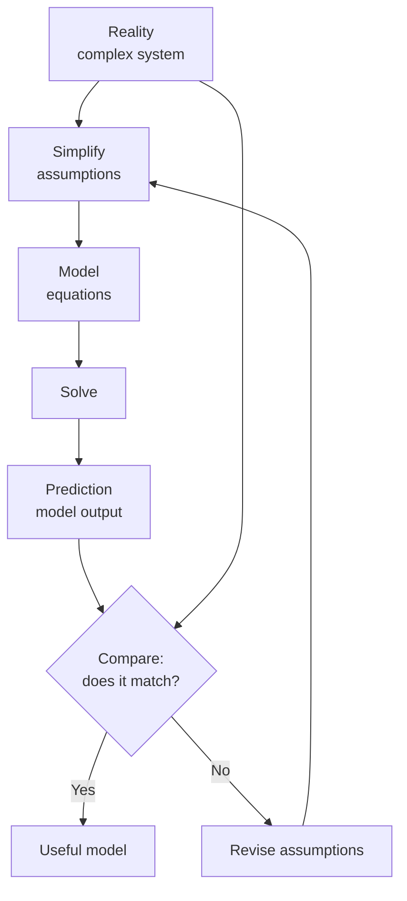

import TawkWidget from '../../../../components/TawkWidget.astro';
import UniversalContentContributors from '../../../../components/UniversalContentContributors.astro';
import InArticleAd from '../../../../components/InArticleAd.astro';
import Copyright from '../../../../components/Copyright.astro';
import BionicText from '../../../../components/BionicText.astro';
import TailwindWrapper from '../../../../components/TailwindWrapper.jsx';
import { Tabs, TabItem } from '@astrojs/starlight/components';
import { Card, CardGrid, Badge, Steps, LinkButton, FileTree } from '@astrojs/starlight/components';

<UniversalContentContributors 
  contributors={frontmatter.contributors}
/>


import PhilosophyOfScienceEngineeringComments from '../../../../components/philosophy-of-science-engineering/PhilosophyOfScienceEngineeringComments.astro';

A SPICE simulation shows your amplifier circuit has perfect stability margins. You build it on a breadboard and it oscillates wildly. The simulation was not lying; it was answering a different question than the one you thought you asked. Every model omits something. The question is whether what it omits matters. Learning to answer that question is one of the most important skills in engineering, and it starts with a philosopher's observation that the map is never the territory. #Models #Simulation #Engineering

## The Map Is Not the Territory

Alfred Korzybski (1879 to 1950) coined the phrase "the map is not the territory" in his 1933 work *Science and Sanity*. The idea is simple but profound: a representation of something is not the thing itself. A map of London is not London. A schematic of a circuit is not the circuit. A simulation of a bridge is not the bridge.

This seems obvious when stated directly. Nobody confuses a paper map with a city. But engineers routinely confuse models with reality in subtler ways.

### Three Levels of Confusion

<Steps>
1. **Level 1: Forgetting the model exists.** "The output voltage is 3.3V." No, the output voltage of the model is 3.3V. The output voltage of the actual circuit is whatever your multimeter reads, which might be 3.28V or 3.35V or something entirely different.

2. **Level 2: Forgetting what the model omits.** "The circuit is stable." The SPICE model says the circuit is stable. But the SPICE model does not include the parasitic inductance of your breadboard wires, the ESR of your capacitors, or the thermal coefficient of your resistors. Are any of those omissions significant?

3. **Level 3: Forgetting that the model can be wrong.** "The thermal simulation shows the junction temperature stays below 125 C." But the thermal model assumes perfect contact between the die and the heatsink, uniform airflow, and steady-state conditions. What if none of those assumptions hold in your actual enclosure?
</Steps>

## All Models Are Wrong, But Some Are Useful

<InArticleAd />


George Box (1919 to 2013), a statistician, gave us the most quoted sentence in modeling philosophy: "All models are wrong, but some are useful." This is not a criticism of models. It is a instruction manual for using them wisely.



### Why All Models Are Wrong

A model is useful precisely because it simplifies reality. A model that captured every detail of reality would be as complex as reality itself and would take as long to run as the real thing. The value of a model comes from what it leaves out.

But what it leaves out is always something. And sometimes that something matters.

| Model | What It Captures | What It Ignores |
|-------|-----------------|-----------------|
| Ohm's Law (V = IR) | Linear relationship between voltage, current, and resistance | Temperature dependence, frequency dependence, nonlinearity at extremes, quantum effects |
| SPICE circuit simulation | Transistor behavior, frequency response, DC operating points | PCB layout parasitics, EMI, manufacturing tolerances, aging effects |
| Finite Element Analysis (FEA) | Stress distribution in a mechanical part | Material microstructure, fatigue effects, surface finish, residual stresses from manufacturing |
| CFD (Computational Fluid Dynamics) | Airflow patterns and thermal distribution | Turbulence model accuracy, mesh resolution limits, boundary condition assumptions |
| Software architecture diagram | Component relationships and data flow | Timing behavior, error propagation, race conditions, actual performance |

Every row in this table represents a model that is genuinely useful and genuinely incomplete. The engineer's job is to know which column matters for the problem at hand.

### When "Wrong" Is Good Enough

<Card title="The 5% Rule of Thumb" icon="approve-check">
In many engineering contexts, a model that predicts reality within 5% is excellent. A SPICE simulation that predicts amplifier gain within 5% is a reliable design tool. The key is knowing what "5% accuracy" means for your application. In audio, 5% might be inaudible. In a medical device, 5% might be lethal.
</Card>

The question is never "is the model right?" (it is not). The question is "is the model accurate enough for this decision?"

Consider choosing a heatsink for a voltage regulator:

```
Scenario A: Consumer electronics, indoor use
  Thermal model accuracy: +/- 10 C
  Safety margin: junction temp 95 C vs 150 C max
  Model accuracy: more than sufficient
  Decision: use the model

Scenario B: Automotive under-hood electronics
  Thermal model accuracy: +/- 10 C
  Safety margin: junction temp 140 C vs 150 C max
  Model accuracy: dangerously insufficient
  Decision: prototype and measure
```

The same model, with the same accuracy, is adequate for one application and dangerous for another. The model did not change. The required precision did.

## When Models Work: SPICE Simulation

<InArticleAd />


SPICE (Simulation Program with Integrated Circuit Emphasis) is one of engineering's most successful modeling tools. Developed at UC Berkeley in 1973, it simulates circuit behavior by solving Kirchhoff's laws and semiconductor device equations numerically.

### Why SPICE Works Well

<CardGrid>
  <Card title="Physics-Based" icon="approve-check">
    SPICE models are derived from semiconductor physics. They are not curve fits or statistical correlations; they are based on the actual physical mechanisms of transistor operation.
  </Card>

  <Card title="Well-Characterized Devices" icon="approve-check">
    Semiconductor manufacturers provide detailed SPICE models for their components, measured on actual production devices. These models capture the essential behavior of real parts.
  </Card>

  <Card title="Known Limitations" icon="approve-check">
    SPICE's limitations are well-documented. Engineers know that SPICE does not model layout parasitics, EMI, or thermal transients (without additional tools). Knowing what the model ignores is as valuable as knowing what it captures.
  </Card>
</CardGrid>

### Where SPICE Fails

Even SPICE, one of engineering's best models, has failure modes:

**Layout effects.** A SPICE simulation treats wires as ideal conductors. On a real PCB, every trace has inductance, capacitance, and resistance. At high frequencies, these parasitics dominate. Your SPICE-perfect amplifier oscillates because the model did not include the 2 nH of inductance in the power supply trace.

**Component tolerances.** SPICE simulates nominal values by default. Real components have tolerances: a 10 kohm resistor might be 9.5 kohm or 10.5 kohm. Monte Carlo simulation (running SPICE thousands of times with randomized component values) helps, but adds significant simulation time.

**Temperature effects.** SPICE can model temperature, but only if you tell it to. The default simulation runs at 27 C. Your product might operate from minus 40 C to plus 85 C. If you do not simulate across that range, you have not tested your design.

**Aging and stress.** SPICE models represent a fresh component. After 10 years of operation at elevated temperature, component parameters drift. SPICE does not model this.

## When Models Fail: The 2008 Financial Crisis

<InArticleAd />


The 2008 global financial crisis is the most dramatic example in recent history of mistaking a model for reality. The engineering lessons are direct and sobering.

### The Model

Financial institutions used mathematical models (most notably the Gaussian copula model, popularized by David Li's 2000 paper) to price complex financial instruments called collateralized debt obligations (CDOs). These models estimated the probability that bundles of mortgages would default.

### The Assumptions

The models made several critical assumptions:

<Steps>
1. **Historical correlations are stable.** The models assumed that the correlation between mortgage defaults observed in past data would persist in the future. This is the induction problem (Hume's problem) applied to finance.

2. **Housing prices can fall locally but not nationally.** The models assumed that housing prices might decline in one city but not across the entire country simultaneously. This assumption had been true for decades, so the models treated it as reliable.

3. **Individual defaults are weakly correlated.** The models assumed that one person defaulting on their mortgage had little effect on whether their neighbor would default. In reality, falling housing prices create a cascade: one foreclosure lowers property values, which pushes more homeowners underwater, which causes more defaults.

4. **The model captures the relevant risk factors.** The models used a small number of parameters to describe complex human behavior involving millions of individual decisions, market psychology, regulatory changes, and macroeconomic forces.
</Steps>

### What Went Wrong

Every assumption was violated simultaneously:

- Housing prices fell nationally, not just locally
- Defaults were highly correlated, creating a cascade
- Historical correlations broke down precisely when they mattered most (during the crisis)
- The simplified model could not capture systemic risk

The result: models that rated CDOs as "AAA" (virtually risk-free) turned out to be pricing instruments that lost 80% to 100% of their value. The models were not just slightly wrong; they were catastrophically wrong in exactly the scenario where accuracy mattered most.

### The Engineering Lesson

<Card title="The Financial Crisis as an Engineering Failure" icon="warning">
The financial crisis was, at its core, a modeling failure. Sophisticated quantitative analysts built models, validated them against historical data, and then treated the models as reality. They forgot that the map is not the territory. Engineers make the same mistake when they say "the simulation passed" without asking what the simulation did not model.
</Card>

**The parallel to engineering:**
- "The thermal simulation shows adequate cooling" but the model assumes laminar airflow and the actual enclosure produces turbulence
- "FEA shows the bracket can handle 500 N" but the model assumes uniform material properties and the real part has a casting defect
- "The firmware simulation runs correctly" but the simulation does not model interrupt timing, memory fragmentation, or power supply glitches

In each case, the model is doing its job. The failure is human: treating the model's answer as reality rather than as one input to a decision.

## Engineering Models and Their Hidden Assumptions

<InArticleAd />


Every engineering model embeds assumptions that are easy to forget once you are focused on the results. Here is a survey of common models and their hidden assumptions.

### Thermal Models

<Tabs>
<TabItem label="What They Model">
- Heat conduction through materials (Fourier's law)
- Convective heat transfer at surfaces
- Radiation exchange between surfaces
- Steady-state and transient temperature distribution
</TabItem>

<TabItem label="Common Hidden Assumptions">
- Perfect thermal contact between surfaces (ignoring thermal interface resistance)
- Uniform material properties (ignoring manufacturing variation)
- Constant ambient temperature (ignoring diurnal or seasonal cycles)
- Steady-state conditions (ignoring thermal transients during startup or load changes)
- Laminar airflow (ignoring turbulence in real enclosures)
- No dust accumulation on heatsinks (which degrades performance 20-40% over years)
</TabItem>
</Tabs>

### Circuit Models

<Tabs>
<TabItem label="What They Model">
- Component behavior (resistance, capacitance, inductance, transistor characteristics)
- DC operating points, AC frequency response, transient behavior
- Noise analysis and distortion
</TabItem>

<TabItem label="Common Hidden Assumptions">
- Ideal interconnections (no trace inductance or capacitance)
- Nominal component values (no manufacturing tolerances)
- Room temperature operation (no temperature variation)
- Fresh components (no aging or degradation)
- Clean power supply (no noise, ripple, or transients)
- No electromagnetic interference from adjacent circuits
</TabItem>
</Tabs>

### Software Models

<Tabs>
<TabItem label="What They Model">
- Functional behavior (input/output relationships)
- State machines and control flow
- Data structures and algorithms
- API contracts and interfaces
</TabItem>

<TabItem label="Common Hidden Assumptions">
- Unlimited memory and stack space
- Deterministic execution timing
- Reliable communication channels (no packet loss, no corruption)
- Single-threaded execution (no race conditions)
- Correct inputs (no adversarial or malformed data)
- Stable platform (no OS updates, no driver changes)
</TabItem>
</Tabs>

## How to Use Models Wisely

<InArticleAd />


Models are essential engineering tools. The solution is not to abandon them but to use them with appropriate skepticism.

### The Five Questions

Before trusting any model's output, ask these five questions:

<Steps>
1. **What are the assumptions?** Every model has them. List them explicitly. If you cannot list the assumptions, you do not understand the model well enough to trust it.

2. **Which assumptions are most likely to be violated?** Rank the assumptions by how likely they are to be wrong in your specific application. Focus your attention on the weakest assumptions.

3. **What happens if the weakest assumption is wrong?** Does the model degrade gracefully (results become slightly less accurate) or catastrophically (results become meaningless)? The financial crisis models degraded catastrophically when their assumptions were violated.

4. **Has the model been validated against physical reality?** Not against another model, but against actual measurements on real hardware in real conditions. Model-to-model validation only confirms that both models make the same assumptions.

5. **What does the model NOT tell you?** This is often the most important question. A SPICE simulation does not tell you about EMI. An FEA simulation does not tell you about fatigue life. A timing simulation does not tell you about thermal behavior. Know the boundaries of what the model can answer.
</Steps>

### Validation: The Bridge Between Model and Reality

<Card title="The Validation Hierarchy" icon="star">
Not all validation is created equal. Here is a hierarchy from weakest to strongest.
</Card>

| Level | Validation Method | Confidence |
|-------|-------------------|------------|
| 1 | Model reviewed by the person who built it | Very low (self-review bias) |
| 2 | Model reviewed by an independent engineer | Low (catches obvious errors) |
| 3 | Model compared against another model | Moderate (confirms consistency, not accuracy) |
| 4 | Model compared against published data | Moderate-high (depends on data quality) |
| 5 | Model compared against your own measurements on a prototype | High (direct validation against reality) |
| 6 | Model predictions tested in production conditions over time | Highest (long-term validation against real-world variability) |

Most engineers stop at level 2 or 3. The models that cause failures are the ones that never reached level 5.

### The Prototype Imperative

<Card title="Rule of Thumb" icon="approve-check">
If your model's output drives a decision with significant consequences (cost, safety, schedule), validate it with a physical prototype before committing. "The simulation passed" is necessary but never sufficient.
</Card>

This does not mean simulations are useless. Simulations are enormously valuable for:
- Exploring the design space quickly and cheaply
- Identifying the most promising design candidates before building prototypes
- Understanding trends and sensitivities (what parameters matter most?)
- Catching gross errors before they become expensive prototypes

But the final answer always comes from reality, not from the model.

## Connecting to Other Courses

<InArticleAd />


The relationship between models and reality connects directly to several other courses in this series:

**Applied Mathematics (Lesson 1: Spherical Cows).** The "spherical cow" joke captures the essence of modeling: simplify reality enough to make the math tractable, but not so much that the answer becomes meaningless. Knowing when your cow is too spherical is the art of engineering modeling.

**Modeling and Simulation.** The dedicated course on modeling techniques covers the practical how-to. This lesson provides the philosophical framework: what models can and cannot tell you, and why that matters.

**Every embedded systems course.** When you simulate firmware behavior, you are building a model. When you test on real hardware, you are validating against reality. The gap between simulation and hardware behavior is the gap between model and territory.

## The Simulation-Reality Gap

<InArticleAd />


```
What the simulation tells you:
  "The circuit has 45 degrees of phase margin
   at the unity-gain frequency."

What reality adds:
  + PCB trace inductance
  + Component tolerance spread
  + Temperature variation
  + Aging effects
  + Manufacturing variation
  + EMI from adjacent circuits
  + Power supply noise
  + Connector contact resistance
  = "The circuit oscillates at 2.3 MHz when the
     room temperature exceeds 35 C."

The gap between these two statements
is the gap between the map and the territory.
```

Every experienced engineer has a story about this gap. The stories are always humbling. And the lesson is always the same: the model is a tool, not an oracle.

## Key Takeaways

<InArticleAd />


<CardGrid>
  <Card title="The Map Is Not the Territory" icon="approve-check">
    Every model simplifies reality. The simplification is what makes the model useful, but it is also what makes it potentially misleading.
  </Card>

  <Card title="Know Your Assumptions" icon="star">
    If you cannot list the assumptions embedded in your model, you do not understand it well enough to trust its output.
  </Card>

  <Card title="Validate Against Reality" icon="approve-check">
    Model-to-model comparison confirms consistency, not accuracy. Only comparison against physical measurements on real hardware validates a model.
  </Card>

  <Card title="Models Fail at the Boundaries" icon="warning">
    Models are most accurate in the center of their operating range and least accurate at the extremes. This is exactly where failures occur: at the boundaries.
  </Card>
</CardGrid>

### Looking Ahead

In the next lesson, we tackle another deep philosophical question with direct engineering implications: the problem of induction. Past performance does not guarantee future results. This is not just a legal disclaimer; it is a fundamental limitation on what engineering experience can tell you. We will explore Hume's problem, Bayesian reasoning, and how engineers make decisions under irreducible uncertainty.

## Exercises

<InArticleAd />


1. **Assumption audit.** Take a simulation or model you have used recently (SPICE, FEA, CFD, or even a spreadsheet calculation). List every assumption embedded in the model. How many assumptions did you discover that you had not explicitly considered before?

2. **Validation gap analysis.** For the same model, identify which level of the validation hierarchy it has reached (1 through 6). What would it take to move it one level higher? Is that investment justified for your application?

3. **The financial crisis parallel.** Identify a model in your own work where the assumptions could be violated simultaneously in a correlated way (similar to the housing market assumptions failing together). What would happen to the model's output in that scenario?

4. **Prototype vs simulation.** Describe a case from your experience where the simulation and the prototype disagreed. What did the simulation miss? How did you resolve the discrepancy? What would you do differently in hindsight?

5. **Spherical cow check.** Pick one of your current projects. What is the "spherical cow" approximation in your model, the simplification that makes the problem tractable but is most likely to diverge from reality? Is it justified for your application, or should you add complexity to the model?

<PhilosophyOfScienceEngineeringComments />


<InArticleAd />
<TawkWidget />
<Copyright />