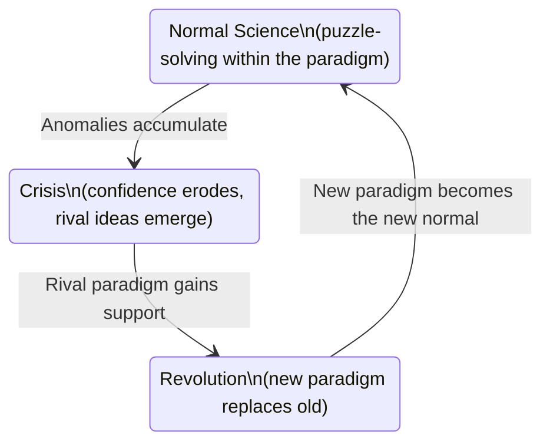

import TawkWidget from '../../../../components/TawkWidget.astro';
import UniversalContentContributors from '../../../../components/UniversalContentContributors.astro';
import InArticleAd from '../../../../components/InArticleAd.astro';
import Copyright from '../../../../components/Copyright.astro';
import BionicText from '../../../../components/BionicText.astro';
import TailwindWrapper from '../../../../components/TailwindWrapper.jsx';
import { Tabs, TabItem } from '@astrojs/starlight/components';
import { Card, CardGrid, Badge, Steps, LinkButton, FileTree } from '@astrojs/starlight/components';

<UniversalContentContributors 
  contributors={frontmatter.contributors}
/>


import PhilosophyOfScienceEngineeringComments from '../../../../components/philosophy-of-science-engineering/PhilosophyOfScienceEngineeringComments.astro';

In 1947, a team at Bell Labs demonstrated a tiny device made of germanium that could amplify electrical signals. Most vacuum tube engineers dismissed it as a curiosity. Within twenty years, vacuum tubes were obsolete for nearly every application. This is what Thomas Kuhn called a paradigm shift, and it happens in engineering with the same patterns, the same resistance, and the same eventual inevitability that Kuhn documented in science. Understanding these patterns will not make paradigm shifts less disruptive, but it will help you recognize them before your expertise becomes obsolete. #ParadigmShifts #Kuhn #EngineeringHistory

## Kuhn's Model of Scientific Revolutions

Thomas Kuhn (1922 to 1996) published *The Structure of Scientific Revolutions* in 1962. It became one of the most influential books of the twentieth century, and the phrase "paradigm shift" entered everyday language (often stripped of its original meaning).

### The Four Phases

<Steps>
1. **Normal science.** Most of the time, scientists work within an established paradigm: a shared set of assumptions, methods, exemplary problems, and standards of evidence. Normal science is puzzle-solving within the paradigm's framework. It is productive, cumulative, and incremental.

2. **Anomaly accumulation.** Gradually, problems arise that the paradigm cannot solve cleanly. These anomalies are initially ignored, explained away, or treated as experimental errors. "That is probably just noise in the data." "Your measurement setup must be wrong."

3. **Crisis.** When anomalies accumulate beyond a certain threshold, the community enters a crisis. Confidence in the paradigm erodes. Alternative approaches proliferate. Arguments become heated. People who have built careers on the old paradigm feel threatened.

4. **Revolution.** A new paradigm emerges that resolves the anomalies. After a period of conflict, the community shifts to the new paradigm. The old paradigm is not just supplemented; it is replaced. The new paradigm redefines the problems, the methods, and the standards of the field.
</Steps>



### A Key Nuance: Paradigms Are Not Just Theories

A paradigm in Kuhn's sense is not just a theory or a technology. It is an entire worldview: the problems worth solving, the methods considered valid, the criteria for a good solution, and the exemplary achievements that define the field. When a paradigm shifts, everything shifts.

## Engineering Paradigm Shifts

<InArticleAd />


Kuhn wrote about science, but his model maps remarkably well onto technology transitions in engineering. Here are six major paradigm shifts, each following Kuhn's four-phase pattern.

### 1. Vacuum Tubes to Transistors (1947 to 1970s)

| Phase | What Happened |
|-------|---------------|
| Normal science | Vacuum tube circuits were well-understood, reliable, and supported by a mature industry of manufacturers, designers, and technicians |
| Anomalies | Tubes were large, hot, power-hungry, and fragile. Reliability problems in early computers (ENIAC had 17,468 tubes and required constant maintenance) were treated as engineering challenges within the tube paradigm |
| Crisis | The transistor (1947) offered an alternative. Early transistors were unreliable and expensive, so many tube engineers dismissed them. But military and space applications demanded smaller, lighter, more reliable electronics |
| Revolution | By the mid-1960s, transistors had won. The integrated circuit (1958) sealed the victory. Vacuum tube expertise became nearly worthless outside niche applications (audio amplifiers, high-power RF) |

**The human cost:** Thousands of skilled vacuum tube engineers had to retrain or retire. Many resisted, insisting that tubes were superior for certain applications. Some were right (tubes still dominate in certain high-power RF contexts), but the overall paradigm had shifted irreversibly.

### 2. Analog to Digital Signal Processing

| Phase | What Happened |
|-------|---------------|
| Normal science | Analog signal processing with op-amps, filters, and modulators was a mature discipline with well-established design methods |
| Anomalies | Analog circuits drifted with temperature, aged with component wear, and required manual calibration. Precision was limited by component tolerances |
| Crisis | Digital signal processors (DSPs) emerged in the 1980s. Early DSPs were slow, expensive, and limited in resolution. Analog engineers argued (correctly, at the time) that DSPs could not match analog performance |
| Revolution | Moore's Law made DSPs fast enough and cheap enough. Software-defined radio replaced hardware receivers. Digital audio replaced analog recording. The new paradigm redefined "signal processing" itself |

### 3. CISC to RISC Architecture

<Card title="The CISC Paradigm" icon="open-book">
Complex Instruction Set Computing (CISC) assumed that more powerful instructions meant better performance. The x86 instruction set grew to hundreds of complex instructions, each taking multiple clock cycles. Compilers and programmers could express operations concisely.
</Card>

<Card title="The RISC Revolution" icon="star">
Reduced Instruction Set Computing (RISC) proposed the opposite: simple instructions, each executing in one cycle, with the compiler doing the optimization. RISC advocates (Patterson, Hennessy) published benchmark data showing RISC outperforming CISC. The debate was fierce. Today, even x86 processors internally translate CISC instructions into RISC-like micro-operations.
</Card>

### 4. Bare Metal to RTOS to Async

In embedded systems, the programming paradigm has shifted multiple times:

```
Phase 1: Bare Metal (Super Loop)
  while(1) {
    read_sensors();
    process_data();
    update_outputs();
  }

  Paradigm: direct hardware control,
  predictable timing, no overhead.

Phase 2: RTOS (FreeRTOS, Zephyr)
  Create tasks, use queues and semaphores.
  The OS manages scheduling and timing.

  Paradigm: concurrency, abstraction,
  separation of concerns.

Phase 3: Async / Event-Driven
  Embassy (Rust), async/await patterns.
  No OS needed, but concurrent by design.

  Paradigm: zero-cost abstractions,
  compile-time concurrency guarantees.
```

Each transition met resistance. Bare metal advocates said RTOS was unnecessary overhead. RTOS advocates say async is too complex. The pattern is the same every time.

### 5. IPv4 to IPv6

| Phase | What Happened |
|-------|---------------|
| Normal science | IPv4 (4.3 billion addresses) worked well for decades |
| Anomalies | Address exhaustion began in the 1990s. NAT (Network Address Translation) was introduced as a workaround |
| Crisis | NAT breaks end-to-end connectivity, complicates protocols, and adds latency. But it "works well enough" for most applications, delaying the crisis |
| Revolution (still ongoing) | IPv6 was standardized in 1998. Adoption has been painfully slow because NAT keeps IPv4 "good enough." This is a paradigm shift where the old paradigm refuses to die gracefully |

This is an important case because it shows that paradigm shifts can stall. When the old paradigm has a workaround (even an ugly one), the transition can take decades.

### 6. Monolithic to Microservices

<Tabs>
<TabItem label="Monolithic Paradigm">
One application, one codebase, one deployment unit. Simple to develop, test, and deploy when the application is small. Becomes increasingly difficult to maintain, scale, and update as it grows.

**Strengths:** Simple deployment, consistent data access, easier debugging.

**Anomalies:** Scaling requires scaling everything. One buggy module crashes the whole application. Deployment risk increases with size.
</TabItem>

<TabItem label="Microservices Paradigm">
Many small services, each independently deployable, each owning its data. Complex infrastructure (service discovery, distributed tracing, eventual consistency) but individually simpler services.

**Strengths:** Independent scaling, independent deployment, technology diversity.

**New problems:** Network latency, distributed transactions, operational complexity. The paradigm solves old problems but creates new ones.
</TabItem>
</Tabs>

## Why Paradigm Shifts Are Resisted

<InArticleAd />


Kuhn observed that paradigm shifts are always resisted, and the resistance comes from rational sources, not just stubbornness.

### Rational Reasons for Resistance

<CardGrid>
  <Card title="Existing Expertise" icon="warning">
    Engineers invest years mastering a paradigm. A 20-year veteran of analog design has deep expertise that becomes less valuable when digital signal processing takes over. This is not irrationality; it is a real loss.
  </Card>

  <Card title="Tooling Investment" icon="warning">
    Companies invest millions in tools, test equipment, manufacturing processes, and training optimized for the current paradigm. Switching costs are enormous and real.
  </Card>

  <Card title="The New Paradigm Is Immature" icon="warning">
    Early transistors were genuinely worse than vacuum tubes for many applications. Early RISC processors did lose to CISC on some benchmarks. The new paradigm needs time to mature, and during that time, resistance is partially justified.
  </Card>

  <Card title="The Old Way Works" icon="warning">
    This is the most powerful form of resistance: the existing paradigm is not broken; it just has some annoying problems. "IPv4 with NAT works fine." "C has been good enough for 50 years." These statements are true. The question is whether they will remain true.
  </Card>
</CardGrid>

### Irrational Reasons for Resistance

Beyond rational concerns, Kuhn identified psychological and sociological factors:

**Identity attachment.** "I am a tube engineer" or "I am a C programmer" ties your identity to the paradigm. Paradigm shifts feel like personal attacks.

**Social proof.** If everyone around you uses the old paradigm, switching feels risky. You become an outsider advocating an unproven approach.

**Selective evidence.** Proponents of the old paradigm notice every failure of the new approach ("see, Rust compile times are terrible") while ignoring its successes.

**Moving the goalposts.** "RISC is faster on benchmarks? Well, benchmarks do not reflect real workloads. RISC handles real workloads better? Well, real-world power consumption matters more. RISC uses less power? Well..."

## The Rust vs C Debate Through Kuhn's Lens

<InArticleAd />


The ongoing debate about Rust as a replacement for C in embedded systems is a paradigm shift in progress. Analyzing it through Kuhn's framework is instructive.

### The C Paradigm (Normal Science)

C has been the dominant language for embedded and systems programming since the 1970s. The paradigm includes:

- Manual memory management (malloc/free)
- Undefined behavior as a feature (enables optimization)
- Programmer responsibility for safety
- Extensive existing codebase, tooling, and expertise
- "The programmer knows what they are doing"

### The Anomalies

- Memory safety bugs (buffer overflows, use-after-free, double free) remain the dominant source of security vulnerabilities. Microsoft reports that 70% of CVEs are memory safety issues.
- Concurrency bugs (race conditions, deadlocks) are difficult to detect and reproduce.
- Undefined behavior creates bugs that depend on compiler version, optimization level, and platform.
- The cost of these bugs, measured in security breaches, system crashes, and engineering time, is enormous.

### The Rust Alternative

Rust proposes a new paradigm:

- Ownership and borrowing enforce memory safety at compile time
- No undefined behavior (in safe Rust)
- Concurrency safety guaranteed by the type system
- Zero-cost abstractions: safety without runtime overhead

### Where We Are in Kuhn's Model

The Rust vs C debate is currently in the **crisis / early revolution** phase:

- The anomalies (memory safety bugs) are well-documented and widely acknowledged
- An alternative (Rust) exists and has demonstrated its ability to resolve the anomalies
- Resistance is strong but weakening (Linux kernel now accepts Rust modules; Android, Windows, and the NSA endorse memory-safe languages)
- The new paradigm is immature in some areas (embedded tooling, ecosystem size, hiring pool)
- The old paradigm's defenders raise legitimate concerns (learning curve, compile times, ecosystem maturity) alongside less legitimate ones ("real programmers do not need a borrow checker")

### What History Suggests

Based on previous paradigm shifts, the likely trajectory is:

1. Rust (or a similar memory-safe systems language) will gradually displace C for new projects where safety matters
2. C will persist for decades in legacy codebases and niche applications (just as assembly persists today)
3. The transition will take 15 to 25 years, not 5
4. Engineers who learn both will be most valuable during the transition

## Incommensurability

<InArticleAd />


One of Kuhn's most controversial ideas is **incommensurability**: the claim that people working in different paradigms sometimes cannot even agree on what the problem is, let alone the solution.

### Engineering Incommensurability

This happens in engineering too. Consider this conversation:

```
C Programmer: "Rust's borrow checker is too restrictive.
  It prevents me from writing the code I want to write."

Rust Programmer: "That is the point. The code you want
  to write has a memory safety bug. The borrow checker
  is preventing the bug."

C Programmer: "That is not a bug. I know what I am
  doing with that pointer."

Rust Programmer: "Statistical evidence shows that
  programmers, including experts, regularly make memory
  safety mistakes in C."

C Programmer: "We have code review and static analysis
  for that."

Rust Programmer: "And yet 70% of CVEs are still
  memory safety issues."
```

They are not really disagreeing about facts. They are operating in different paradigms with different definitions of what constitutes a "problem" and what constitutes an acceptable "solution." The C paradigm treats programmer discipline as the solution. The Rust paradigm treats compiler enforcement as the solution. These are different worldviews, not just different technical opinions.

## Lakatos: Progressive vs Degenerating Programs

<InArticleAd />


Imre Lakatos (1922 to 1974) offered a refinement of Kuhn's model. Instead of sudden revolutions, Lakatos described **research programs** that can be either progressive or degenerating.

### Progressive Research Programs

A progressive research program generates new predictions and explanations. It is growing, surprising, and productive.

**Indicators of a progressive engineering paradigm:**
- Enabling new applications that were previously impossible
- Attracting new practitioners and investment
- Solving old problems and revealing new, interesting ones
- Generating new tools, methods, and best practices

### Degenerating Research Programs

A degenerating research program spends most of its energy explaining away anomalies rather than generating new predictions. It is defensive and backward-looking.

**Indicators of a degenerating engineering paradigm:**
- Increasingly complex workarounds for known limitations
- Most innovation is defensive ("how to avoid the problems of X")
- Community energy focused on maintaining existing systems rather than building new ones
- New practitioners choose alternatives

### Applying Lakatos

| Question | Progressive Sign | Degenerating Sign |
|----------|-----------------|-------------------|
| What are the recent innovations in this technology? | New capabilities, new applications | Better workarounds for old problems |
| Where is the talent going? | New graduates choose this technology | Practitioners are aging out, few new adopters |
| What is the community talking about? | New possibilities, exciting projects | Defending against alternatives, nostalgia |
| What problems does this technology solve that it could not solve 5 years ago? | Many: it is growing in capability | Few: it is mature and stable (or stagnant) |

Lakatos gives you a tool for evaluating where a technology stands without the drama of Kuhn's revolutionary framework. A technology does not have to be "overthrown" to be declining. It can simply stop generating new value.

## What This Means for Your Career

<InArticleAd />


Understanding paradigm shifts is not just intellectually interesting. It is career-critical.

### How to Recognize a Paradigm Shift in Progress

<Steps>
1. **Watch for accumulating workarounds.** When a technology requires increasingly complex workarounds for fundamental limitations, a paradigm shift may be forming. NAT for IPv4. Manual memory management discipline for C. Virtual DOM reconciliation for imperative UI frameworks.

2. **Follow the anomalies.** What problems does the current paradigm consistently fail to solve? These are the pressure points where a new paradigm will emerge.

3. **Notice the newcomers.** New practitioners choose technologies based on current merits, not historical loyalty. If new engineers overwhelmingly prefer a different approach, the shift is underway.

4. **Read across fields.** Paradigm shifts in one field often parallel shifts in others. The move from analog to digital happened in audio, video, communications, and control systems. Recognizing the pattern in one field helps you see it in another.

5. **Distinguish discomfort from danger.** Learning a new paradigm is uncomfortable. That discomfort is not a valid argument against the paradigm. Evaluate on merits, not on how familiar it feels.
</Steps>

### The Practical Strategy

You do not need to predict which new technology will win. You need to:

- Maintain awareness of alternatives to your current paradigm
- Invest some learning time in emerging paradigms (even if you do not adopt them yet)
- Build transferable skills that span paradigms (problem-solving, testing methodology, system architecture thinking)
- Avoid tying your identity to a specific technology

## Key Takeaways

<InArticleAd />


<CardGrid>
  <Card title="Paradigm Shifts Follow a Pattern" icon="approve-check">
    Normal science, anomaly accumulation, crisis, revolution. Knowing the pattern helps you recognize where you are in the cycle.
  </Card>

  <Card title="Resistance Is Partially Rational" icon="open-book">
    Existing expertise, tooling investment, and the immaturity of new paradigms are legitimate concerns. But they are reasons to be cautious, not reasons to be blind.
  </Card>

  <Card title="Watch for Degenerating Programs" icon="warning">
    Lakatos's framework: is your paradigm generating new capabilities, or mostly defending against alternatives? The answer matters for your career.
  </Card>

  <Card title="Stay Adaptable" icon="star">
    The engineers who thrive across paradigm shifts are the ones who learn the new paradigm early enough to be ahead of the curve, but late enough that the paradigm has matured enough to be practical.
  </Card>
</CardGrid>

### Looking Ahead

In the next lesson, we examine a more fundamental philosophical question: what is the relationship between our models and reality? Every simulation, every schematic, every equation is a map. The territory is always more complex. Understanding this distinction is critical for every engineer who has ever said "the simulation passed" and then watched the hardware fail.

## Exercises

<InArticleAd />


1. **Paradigm shift mapping.** Choose a technology transition you have personally experienced (or one from your field). Map it onto Kuhn's four phases. Where is it now? What anomalies drove the transition?

2. **Lakatos evaluation.** Pick two competing technologies in your field (e.g., two programming languages, two communication protocols, two design methodologies). Evaluate each as a Lakatosian research program: is it progressive or degenerating? What evidence supports your assessment?

3. **Incommensurability detection.** Find an online debate between proponents of two competing technologies. Identify at least one instance where the participants are talking past each other because they operate in different paradigms with different definitions of the problem.

4. **Career paradigm audit.** List the three technologies you spend the most time on. For each one, assess: is this paradigm in the normal science phase, the anomaly accumulation phase, or the crisis phase? What would you do differently if it were further along the curve than you think?

<PhilosophyOfScienceEngineeringComments />


<InArticleAd />
<TawkWidget />
<Copyright />